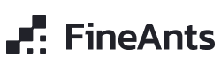
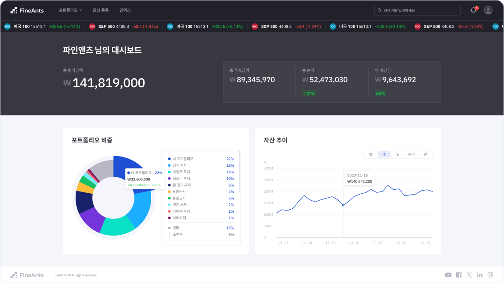
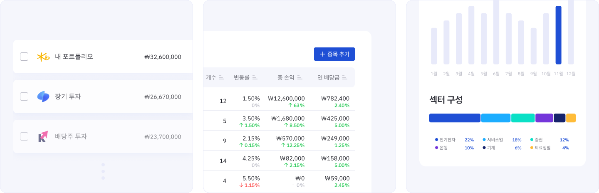

**LINK:** [https://www.fineants.co](https://www.fineants.co/)

## About

FineAnts는 파편화된 포트폴리오 관리를 보다 파악하기 쉽게 통합한 서비스입니다. 현재 증권사들의 HTS나 MTS는 한 개의 계좌내에서 여러개의 포트폴리오를 구성한 투자를 진행할 수 없습니다. 자연스럽게 사용자들은 여러개의 증권사의 계좌를 운용하게 되고, FineAnts는 이렇게 파편화된 정보들을 한 번에 파악하고 관리할 수 있게 도와주는 서비스입니다.

## Features

**자산 현황**

- 사용자의 현재 자산 평가 금액, 총 투자 금액, 총 손익, 연 배당금 전체적인 자산 현황을 확인할 수 있음
- 포트폴리오 비중, 총 자산 현황 추이를 파이 차트와 라인 차트로 시각화하여 한 눈에 파악하기 용이함

**포트폴리오 목록**

- 다수의 포트폴리오를 계좌별로 설정하여 관리할 수 있음
- 계좌를 별도로 설정하지 않고 모의투자를 위한 포트폴리오로도 사용 가능

**포트폴리오 상세정보**

- 해당 포트폴리오의 자세한 실시간 정보 확인 가능
  - 예산, 투자금액, 잔고, 잠정 손실잔고
  - 목표 수익률, 최대 손실율
  - 총 손익, 당일 손익
  - 총 연 배당금, 투자대비 연 배당률
- 매수한 종목 목록과 각 종목별 매입이력을 관리가능

**알림**

- 포트폴리오 목표 수익률 및 최대 손실율 도달 알림
- 종목 지정가 도달 알림

**관심종목**

- 관심종목 목록을 여러 개 생성해 관리할 수 있음

**종목 상세정보**

- 해당 종목의 현재 시세를 확인할 수 있는 차트와 배당금 등 자세한 정보들을 확인할 수 있음

**인덱스**

- 트레이딩뷰에서 제공하는 인덱스 위젯을 통해 주요 지수를 한 눈에 살펴볼 수 있음

## Stack

